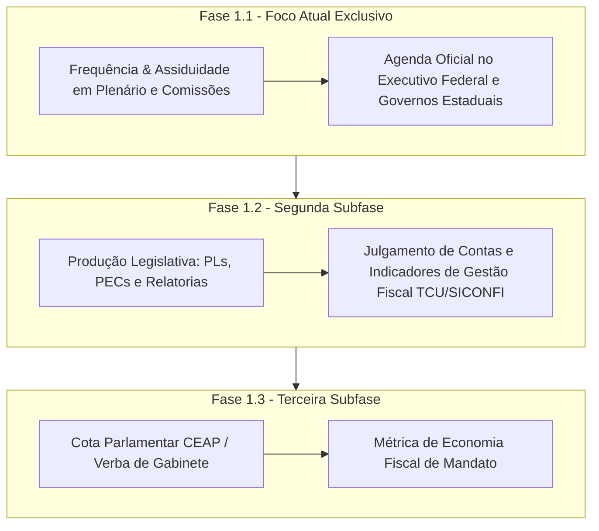
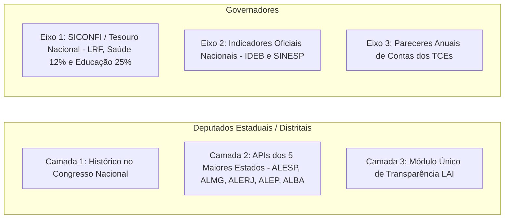

# 📋 Plano de Desenvolvimento — Fase 1: Desempenho Público

Este documento consolida o plano de desenvolvimento refinado da **Fase 1: Desempenho Público**, incluindo o mapeamento das documentações técnicas das APIs governamentais, o plano detalhado para **Deputados Estaduais e Governadores** e a divisão em **Subfases 1.1, 1.2 e 1.3**.

---

## 🏛️ 1. Visão Geral e Estrutura de Subfases

**Objetivo**: Metrificar a atuação factual de candidatos experientes nos mandatos anteriores, garantindo isenção total e idoneidade ao utilizar exclusivamente APIs públicas e oficiais.



---

## 🗺️ 2. Plano Detalhado para Deputados Estaduais e Governadores

Para superar a complexidade da dispersão dos 27 estados sem depender de crawlers frágeis, adotamos um **plano técnico em 3 camadas de integração**:



### A. Plano para Deputados Estaduais / Distritais (27 UFs)

1. **Camada 1 — Mandato Federal Prévio (Cobertura Imediata ~45%)**:
   - Grande parte dos deputados estaduais de destaque já exerceu mandato como Deputado Federal ou Senador.
   - O crawler integrado da Câmara e Senado extrai automaticamente o histórico completo desses candidatos sem depender das assembleias estaduais.
2. **Camada 2 — Integradores das 5 Maiores Assembleias Legislativas (Cobertura ~55% da População)**:
   - Construção dos conectores para as 5 maiores ALEs do país que já possuem portais de dados abertos/APIs estruturados:
     - **ALESP** (São Paulo): `dadosabertos.al.sp.gov.br` (API REST).
     - **ALMG** (Minas Gerais): `dadosabertos.almg.gov.br/ws/` (API REST).
     - **ALERJ** (Rio de Janeiro): Portal de Transparência e Diário Oficial.
     - **ALEP** (Paraná): API de Transparência da ALEP.
     - **ALBA** (Bahia): Portal de Dados Abertos ALBA.
3. **Camada 3 — Padronização de Dados via LAI (Lei de Acesso à Informação)**:
   - Coletor genérico estruturado para processar a frequência em plenário das demais 22 Assembleias Legislativas.

---

### B. Plano para Governadores (Poder Executivo Estadual)

1. **Eixo 1 — Responsabilidade Fiscal e Balanço Orçamentário (API SICONFI / Tesouro Nacional)**:
   - Utilização da **API pública unificada do SICONFI/Tesouro Nacional** (`siconfi.tesouro.gov.br`), que centraliza os dados fiscais de todos os 27 estados do Brasil em uma única interface:
     - **Limite com Pessoal (LRF)**: Verificação do cumprimento do teto de gastos com funcionalismo público.
     - **Aplicação Mínima Constitucional em Saúde (12%)**: Percentual efetivamente aplicado na Saúde durante o mandato.
     - **Aplicação Mínima Constitucional em Educação (25%)**: Percentual efetivamente aplicado na Educação durante o mandato.
2. **Eixo 2 — Indicadores Sociais Oficiais Consolidados (MEC/INEP e MJSP)**:
   - Avaliação objetiva dos resultados de gestão durante o mandato do governador através de bancos federais consolidados:
     - **Educação**: Variação do **IDEB** (Índice de Desenvolvimento da Educação Básica) na rede estadual de ensino médio (fonte: INEP/MEC).
     - **Segurança Pública**: Variação das taxas de Crimes Violentos Letais Intencionais (fonte: SINESP / Ministério da Justiça).
3. **Eixo 3 — Pareceres de Contas Anuais de Gestão (TCEs)**:
   - Registro factual do parecer prévio emitido pelo Tribunal de Contas do Estado sobre o balanço anual de governo (*Contas Aprovadas*, *Aprovadas com Ressalvas* ou *Rejeitadas*).

---

## 📖 3. Documentação das APIs Oficiais para Construção dos Crawlers

Abaixo estão os links oficiais da documentação técnica e os endpoints exatos para a construção dos nossos integradores:

### A. Câmara dos Deputados (Deputados Federais)
- **Documentação Swagger/OpenAPI Oficial**: [https://dadosabertos.camara.leg.br/swagger/api.html](https://dadosabertos.camara.leg.br/swagger/api.html)
- **Endpoints Chave para a Fase 1.1**:
  - `GET /deputados/{id}/eventos`: Lista de sessões e reuniões com presenças e ausências confirmadas.
  - `GET /deputados`: Busca do ID do deputado a partir do CPF ou nome.
- **Formato**: REST / JSON (Sem necessidade de autenticação).

### B. Senado Federal (Senadores)
- **Documentação OpenAPI Oficial**: [https://legis.senado.leg.br/dadosabertos/docs/ui/index.html](https://legis.senado.leg.br/dadosabertos/docs/ui/index.html)
- **Endpoints Chave para a Fase 1.1**:
  - `GET /senador/{codigo}/votacoes`: Presença e votos do senador nas sessões deliberativas.
- **Formato**: REST / JSON ou XML.

### C. SICONFI / Tesouro Nacional (Governadores & Estados)
- **Documentação Oficial**: [https://siconfi.tesouro.gov.br/siconfi/pages/public/conteudo/conteudo.jsf?qual=api](https://siconfi.tesouro.gov.br/siconfi/pages/public/conteudo/conteudo.jsf?qual=api)
- **Endpoints Chave para a Fase 1.2**:
  - `GET /rgf`: Relatório de Gestão Fiscal dos 27 Estados (despesa com pessoal e limites LRF).
  - `GET /rreo`: Relatório Resumido da Execução Orçamentária (gastos constitucionais em Saúde e Educação).
- **Formato**: REST / JSON.

### D. Tribunal de Contas da União (TCU)
- **Documentação Dados Abertos**: [https://dados.tcu.gov.br/](https://dados.tcu.gov.br/)
- **Endpoints Chave para a Fase 1.2**:
  - `GET /acordaos`: Julgamento de contas de gestão de autoridades públicas.
- **Formato**: REST / JSON.

---

## 🎯 4. Detalhamento da Fase 1.1 — Frequência & Assiduidade (MVP)

A **Fase 1.1** focará **exclusivamente na Frequência e Assiduidade**, dividida por cargo:

### 🏛️ Cargo Legislativo (Deputado Federal, Senador e Deputado Estadual)
- **Métrica 1**: Taxa de Presença em Plenário (`presencasPlenario / totalSessoesPlenario * 100`).
- **Métrica 2**: Taxa de Presença em Comissões (`presencasComissoes / totalReunioesComissoes * 100`).
- **Métrica 3**: Distinção Factual entre Faltas Justificadas (licença médica/missão oficial) e Faltas Não Justificadas.

### 🏢 Cargo Executivo (Presidente da República e Governadores)
- **Métrica 1**: Assiduidade e cumprimento da Agenda Oficial de Governo.

---

## 🛠️ 5. Arquitetura do Crawler (`camaraFetcher.ts` e `siconfiFetcher.ts`)

```typescript
// Exemplo de integração do SICONFI para avaliação fiscal de Governadores
export async function fetchGovernorFiscalData(uf: string, ano = 2024) {
  // GET dados do Relatório de Gestão Fiscal do Estado via API SICONFI (Tesouro Nacional)
  const url = `https://apidatalake.tesouro.gov.br/ords/siconfi/tt/rgf?an_exercicio=${ano}&id_tv=2&an_anexo=1&in_periodicidade=Q&nr_periodo=3&co_esfera=E&sg_uf=${uf}`;
  const response = await fetchJson(url);

  // Processar cumprimento dos limites LRF e gastos mínimos em Saúde e Educação
  return parseFiscalHealthMetrics(response?.items || []);
}
```

---

*Documento atualizado com o plano detalhado para Deputados Estaduais e Governadores no Criterium.*
